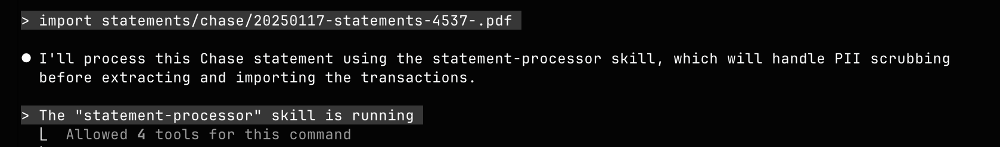
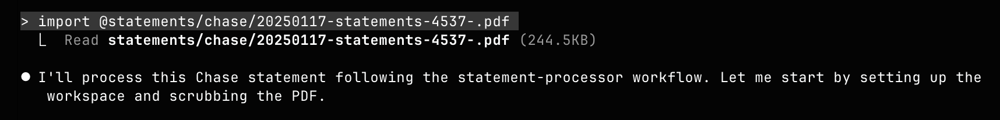
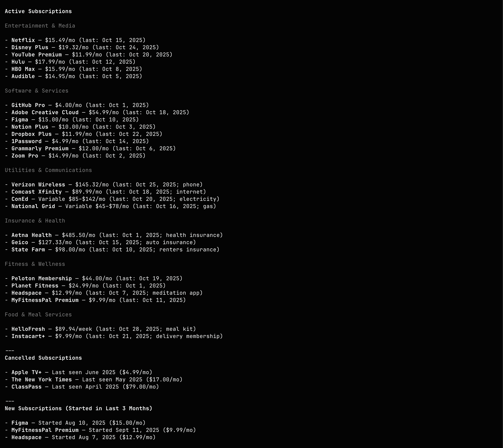

I've been building an [open source personal finance agent](https://github.com/figelwump/fin-agent) called `fin-agent` that can import bank statements in a privacy sensitive way, analyze/categorize spending, detect subscriptions, find unusual spending, and generally run any analyis on your locally-stored, anonymized financial data. 

Here's an example of statement import and transaction categorization (video is sped up 3x):

<video controls width="640" height="360" preload="metadata">
  <source src="/posts/2025-11-06-notes-on-claude-skills/import_110425_3x.mp4" type="video/mp4">
  Your browser does not support the video tag.
</video>

I've gone through a few iterations of the agent and the supporting CLI tools. My latest iteration uses Claude Skills to drive the agent. I think skills are a nice abstraction, and worth exploring more. Here are some notes on what I've learned so far.

## What are Claude Skills?

[Claude Skills](https://docs.claude.com/en/docs/agents-and-tools/agent-skills/overview) are a feature of Claude Code (CC) that allows you to define agent behavior for specific use cases. Skills are simple in practice: they are just a folder and a `SKILL.md` doc. 

**Note**: something I missed at first is that skills _must_ be located in `.claude/skills` of the current working directory or `~/.claude/skills` or they won't be discovered by Claude Code.

Skill.md files don't have a set format, but they do require a frontmatter section with name, description. You can optionally specify allowed tool permissions or specify a particular model that should be used when executing the skill. From `fin-agent`'s `statement-processor` skill:

```
---
name: statement-processor
description: Process, extract, and import bank/credit card statements from PDF files into the local SQLite database. Use when asked to import statements, process PDFs, or extract transactions from statement files.
allowed-tools: Bash, Read, Grep, Glob
---
```

The description is used by CC as a hint to discover when it should invoke the skill given a user message. The exact language in the description is _critical_ and will need some iterating until you see CC consistently invoking the skill given your test prompts:



If a skill matches, then CC will pull in the rest of the `SKILL.md` into context. You can reference additional markdown files, scripts, etc from the skill.md file and those will be pulled in/executed as needed.

There are aspects of skills which are similar to MCP (at least in utility if not implementation), and aspects which don't seem much more than a glorified CLAUDE.md/AGENTS.md file. There are some important distinctions however:

- **Progressive disclosure**: CC only pulls in the skill frontmatter into context, which is very token efficient compared to MCP or bloating your CLAUDE.md file. Only if there is a match at the frontmatter level will it pull in the full skill.md file.
- **Script calling**: You can instruct CC to run scripts (i.e. anything you can invoke with the Bash permission) during a skill invocation -- these could be scripts you have written, globally installed CLIs, or pretty much anything bash can do. 
- **File system**: CC can be given access to read/write to the file system. This gives you databases, working areas for the model to read/write scratch files, etc. Combined with script calling, this is very powerful.
- **Simple**: Simple to setup and simple to iterate on.
- **Composable**: Skills can be composed together to create sophisticated workflows.

## What fin-agent can do

To illustrate what skills can do and how I approached it with `fin-agent`, I'll give a few examples here.

### Heterogenous workflows

Here's the main workflow in the `statement-processor`, taken straight from its `SKILL.md`. You can see that beyond the typical agent-based LLM model responses, you can mix in script/CLI calling, invoking the LLM with dynamically built prompts, and handing off to other skills:

1. **Scrub sensitive data into the workspace:**
```bash
fin-scrub statement.pdf --output-dir $WORKDIR
```

2. **Build the prompt** (single statement per invocation):
```bash
python $SKILL_ROOT/scripts/preprocess.py \
--workdir $WORKDIR \
--input $WORKDIR/<file>-scrubbed.txt
```

3. **Send the prompt to your LLM** (Claude, etc.) and save the CSV response to `$WORKDIR/<filename>.csv`.

4. **Enrich and apply known patterns:**
```bash
python $SKILL_ROOT/scripts/postprocess.py \
--workdir $WORKDIR \
--apply-patterns --verbose
```

5. **Import validated rows** (preview first, then apply with pattern learning):
```bash
# Preview
fin-edit import-transactions $WORKDIR/<file>-enriched.csv

# Apply
fin-edit --apply import-transactions $WORKDIR/<file>-enriched.csv \
--learn-patterns --learn-threshold 0.75
```

6. **Hand off to transaction-categorizer skill** to handle remaining uncategorized transactions. Verify success with:
```bash
fin-query saved uncategorized --limit 5 --format csv  # Should shrink

fin-query saved merchant_patterns --limit 5 --format csv  # Should reflect new patterns
```

7. **If any command fails** or the sanity checks above are unexpected, stop the loop and resolve the issue before moving to the next statement.

### Bash and the file system

Bash is used extensively throughout the `fin-agent` skills. It's used to invoke pre/post processing scripts and the custom CLIs (`fin-scrub`, `fin-edit`, `fin-analyze`, and `fin-query`) built specifically for fin-agent to work more effectively, efficiently and safely.

The agent is instructed to output results from each command to a local file, and to read from the file for the next step. We ask the agent to create a working directory specific to each run of the skill (stored in the `$WORKDIR` "variable." We're using variable-like syntax inside the `SKILL.md` text file in hopes the LLM understands this, which it actually does). Intermediate files are read/written from there. 

The processed financial ledger is stored in a local SQLite DB, which again is just a file. The agent is instructed to use the `fin-query` and `fin-edit` tools to interact with the DB to enforce best practices (escaping, confirming edits before writing, schema details, etc).

The file system approach to storing state allows the agent to recover from failures more easily, gives us better observability into what the agent is doing, and generally just seems to work better with agents rather than asking them to pass around a lot of data in the context. The tradeoff is that it's a bit slower, but the gain in reliability and observability is worth it.

### Composability

You can keep skills well-scoped and compose them together as needed. For example, step 6 above will pass off to the `transaction-categorizer` skill if needed. This just works seamlessly.

### Specialized workflows 

You can guide the agent to follow specialized workflows within a skill. This is essentially another level of progressive disclosure at work.

For example, in the `spending-analyzer` skill, there is a section with notes on specialized workflows like subscription and unusual spend detection and when the agent should invoke them:

```
**Subscription Detection**
Workflow: See $SKILL_ROOT/workflows/subscription-detection.md
Use case: LLM analyzes transaction patterns from merchant-frequency and transaction history to identify recurring charges and subscriptions.

**Unusual Spending Investigation**
Workflow: See $SKILL_ROOT/workflows/unusual-spending-detection.md
Use case: LLM compares spending patterns across time periods to identify anomalies, new merchants, and spending spikes.
```

### Error detection/correction

As you encounter issues running the skill, or find points in the flow where the agent in inconsistent (you inevitably will), it's useful to add a section on error handling/troubleshooting. An example from the `spending-analyzer` skill:

```
Common Errors
- **Invalid date format**: Use `YYYY-MM` for `--month` (e.g., `2025-09`) and periods like `3m`, `6m`, `12m`, or `all` for `--period`
- **No data for period**: Check if transactions exist in the specified time range with `fin-query saved transactions_month --param month=YYYY-MM --limit 500 --format csv`
- **Unknown analyzer**: Run `fin-analyze --help` to see available analyzers or check `$SKILL_ROOT/reference/all-analyzers.md`
- **Unknown category**: Verify category name with `fin-query saved categories --limit 200 --format csv`. Use exact spelling including ampersands (e.g., `"Food & Dining"`).
```

## Quirks

There are some quirks and rough edges when working with skills. Here are some I encountered:

### @-mention imports

The point of the `statement-processor` skill is to first locally scrub a bank statement PDF of any PII, account numbers, etc. Then the scrubbed text is sent to the LLM to parse and analyze -- but we never want to send the LLM sensitive information. 

This all works as expected if your prompt in Claude Code is something like:


But if you @-mention the PDF file, you get a bit of a surprise:



Claude Code reads the file first! And then it proceeds to sort of start the skill's workflow without really invoking the skill first?

@-mention imports are special syntax in CC that forces the contents of the mentioned file to be put into the context window. Definitely not what we want for this feature, but it's a subtle difference and easy to use the @-mention syntax if you're already used to using it.

### Relative paths

In the `statement-processor` workflow above, you'll notice the use of a `$SKILL_ROOT` "variable." It's defined like so:

```
**Resource root (do not `cd` here):** `$SKILL_ROOT` = `.claude/skills/statement-processor`
```

The reason for this is how skills handle relative paths. By default, Claude Code will assume paths provided in the `SKILL.md` are relative to the working directory where you are _currently running CC_, not the location of the skill file. This is counterintuitive and I consider this a rough edge in the current design of Skills -- the agent knows the full path to the skill, and should ideally use that by default when resolving relative paths.

### Watch out for duplicative examples/references

I had Claude Code write the first draft of the skills. It has a tendency to duplicate information in the main `SKILL.md` with supporting reference docs. This has little benefit, and tends to confuse the agent. It also makes the skill harder to maintain because you now need to maintain logic/examples in multiple places. 

Simplifying to put most things in the main skill.md, and only utilizing additional docs for more complicated, specific workflows (like subscription detection) or things like CSV schema significantly improved the reliability of the agent.

## It works!

If you want to try out `fin-agent`, it works! You can import bank/credit card statements, breakdown spending data by category or merchant, analyze spending trends, detect subscriptions and unusual transactions, and drill into details. It's more of a DIY/developer-focused interface, but it's powerful and works fairly well.

An example of what the output of subscription detection might look like (mock data, not my personal subscriptions):



Skills have been the best fit for driving `fin-agent` that I've experimented with so far. After a while, iterating on the skill file and the supporting workflows, deterministic scripts, sub-prompts, etc starts feeling like "programming in natural language." You can build fairly sophisticated workflows to drive the agent without letting complexity get out of control. 


